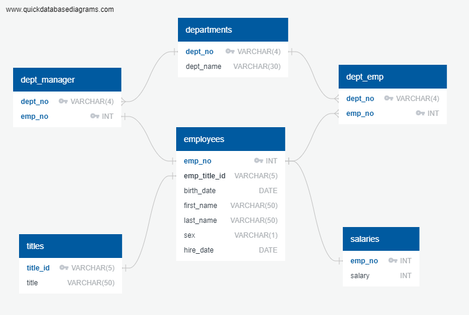

# sql-challenge
Week 9: SQL Challenge

ERD of Employee DB

The SQL query format of this ERD diagram is [here](EmployeeSQL\table_schemata.sql)

The SQL query for data analysis part can be found [here](EmployeeSQL\sql-challenge.sql)
